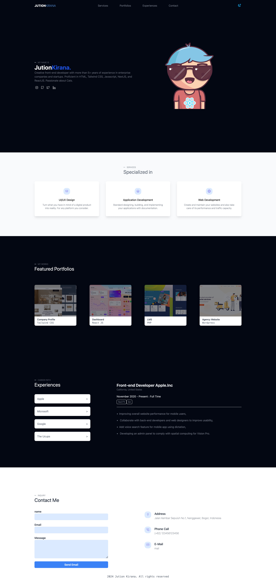

# Angular Section

This project was generated with [Angular CLI](https://github.com/angular/angular-cli) version 18.0.6.

## Task 1

Dari gambar di atas, buatkan component terpisah seperti:

1. Header
2. Footer
3. Hero Section
4. Services Section
5. Portofolios Section
6. Experiences Section
7. Contact Section

Catatan:

1. Nomor `1 - 2` buatkan di dalam folder `shared/components`
2. Nomor `3 - 7` buatkan di dalam folder `pages`
